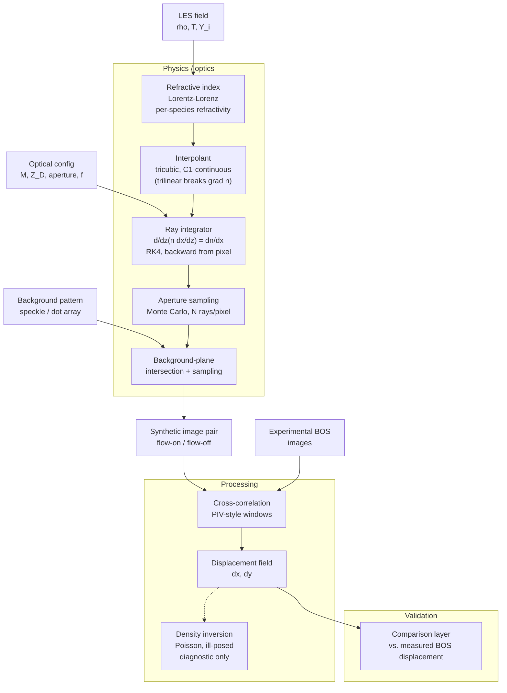

# Architecture

This repository holds two ray tracers that answer the same question — *what would a camera
record looking through this flow?* — from two different kinds of input, plus the
post-processing needed to turn a ground-truth optical field into something an experiment
could actually have measured.

## Overview



## Implemented vs specified

The diagram above is the intended architecture. The code does not yet meet it everywhere,
and the gaps matter — two of them are physics, not plumbing.

| Stage | Specified | In the code today |
|---|---|---|
| refractive index | **Lorentz–Lorenz**, per-species refractivity | **Gladstone–Dale**, `n = 1 + K·ρ`, mixture by composition-weighted `K` — linear in density, no per-species dispersion |
| interpolant | **tricubic, C¹-continuous** — *trilinear breaks ∇n* | **hardware trilinear** (`sampleF` / `gradF`). This is exactly the deficiency the spec warns about: trilinear is C⁰, so ∇n is discontinuous across cell faces and the eikonal integrand is only piecewise constant |
| ray integrator | `d/dz(n dx/dz) = ∂n/∂x`, RK4, backward from pixel | RK4 eikonal march (`marchRay`, `mode eikonal`), started at the camera plane — matches |
| aperture sampling | Monte Carlo, N rays/pixel | `naper` rays/pixel over a thin-lens disc converging at `zf` — matches |
| background plane | intersection + sampling | implemented; rays that cannot reach it (TIR, opaque liquid) are flagged `NaN` in the kernel |
| image pair | flow-on / flow-off | `bos_correlate.py` warps a fixed target; `bos_realistic_target.py` adds **independent** camera noise per frame, which is what makes the pair realistic |
| cross-correlation | PIV-style windows | windowed FFT, subpixel Gaussian peak, loss-of-pairs correction |
| **experimental images → same correlator** | yes — the point of the comparison layer | **not wired up.** Validation today is against closed-form analytic cases only (`gpu_validate.py`, `validate_schlieren_bos.py`), not against measured BOS |
| **density inversion** | Poisson, ill-posed, diagnostic only | **not implemented** |

Two consequences worth stating plainly:

1. **The trilinear interpolant is a known accuracy limit, not an oversight to ignore.** It is
   cheap (hardware-accelerated, and it is what buys ~300 Mrays/s) and the validation still
   closes to 0.19% on a *linear* gradient — which is precisely the case where C⁰ vs C¹ cannot
   show up, because ∇n is constant. On a field with curvature the discontinuous gradient is
   the leading error term. A `presmooth` σ≈1 in `foam_shadowgraph.py` partly mitigates it by
   smoothing the field before sampling, but that is a blur, not continuity.
2. **Nothing in the repo yet compares against a measurement.** Every number quoted under
   Validation is synthetic-vs-analytic. The comparison layer and the experimental branch are
   the missing half of the architecture.

The rest of this document describes what exists.

## The two tracers, and why both

They are complementary, not redundant, and the split is about what the input *is*:

| | `ReadSTL` (CPU) | `gpuShadow` (GPU) |
|---|---|---|
| input | triangulated **surface** (STL), or one ASCII `.vts` **volume** (`VTKRT_VOLUME=1`, cell array `rho_s`) | sampled **volume** (`grid.bin`), optionally two fields |
| interface | explicit — marching-cubes surface, averaged vertex normals | implicit — trilinear threshold crossing, normal from local gradient |
| acceleration | OBB tree intersection | 3-D texture, no BVH, no cell locator |
| throughput | ~15–30 s per frame | ~300 Mrays/s, 3–5 ms per frame |
| output | `out.bmp` | `img.bin` (float32), 7 output modes |

The surface path is the right tool when the geometry *is* a surface and you want an exact,
explicitly-normalled interface. The volume path is the right tool for graded-index gas
fields, for anything needing schlieren or BOS, and for everything where throughput matters.
The GPU tracer supersedes the CPU one for volumetric work.

`ReadSTL` is configured by environment variable rather than flags — `VTKRT_INTERFACE`
(`sharp` = one refracting surface at the α=0.5 iso-level, `diffuse` = nested iso-index
shells, the default), `VTKRT_NCONTOURS`, `VTKRT_ISOVALUE`, `VTKRT_OUT` (so concurrent
processes write distinct files), and `VTKRT_FRAME_BOUNDS` (so an image *sequence* shares one
bounding box instead of each frame re-fitting its own).

## Physics chain

Both tracers implement the same chain; they differ only in how the field is represented.

1. **Field → refractive index.** Gladstone–Dale, `n = 1 + K·ρ`. For a mixture the constant
   is composition-weighted, e.g. `n − 1 = ρ(Y·K_a + (1−Y)·K_b)`.
2. **Index → ray path.** Either a discrete jump at a resolved interface (Snell, with total
   internal reflection) or continuous bending through a gradient (eikonal, RK4).
3. **Path → detector.** Acceptance-angle transmittance (shadowgraph), knife-edge cut at the
   focal plane (schlieren), or apparent displacement of a background a distance `L_bg`
   behind the test section (BOS).

Steps 1–3 give *ground truth*. Step 4 — the `POST` block above — is what makes a synthetic
image comparable to a measurement: no experiment can read the deflection field directly, it
correlates two images of a patterned background and inherits window-scale smoothing,
peak-locking, dropout and camera noise in the process.

## Where fidelity is won and lost

The non-obvious failure modes, all documented in detail in [`../gpu/README.md`](../gpu/README.md):

- **Sampling a VoF field onto the grid.** `scatter` bins cells by centre and keeps detached
  droplets; `resample` interpolates smoothly but averages a 1–2-cell droplet below α=0.5, so
  **it vanishes**. Choose by whether you are drawing a coherent core or an atomising spray.
- **Grid resolution is not image resolution.** The kernel trilinear-upsamples the volume for
  free, so render the *image* finer rather than the *grid* — upsampling the grid is slow and
  adds no real detail.
- **BOS has a measurable envelope.** A correlation window resolves roughly 0.1 px to a
  quarter of the window. On interface-resolved sprays the deflection spans ~4 orders of
  magnitude, so **no single standoff `L_bg` puts the whole field in range.** Pick `L_bg` for
  the part of the flow you want, and say which.
- **Invalid rays must be flagged in the kernel.** Rays turned back by TIR or extinguished in
  opaque liquid are returned `NaN`. Without that, grazing incidence drives `tan(ε)` to
  infinity and the image is nonsense.
- **Dot density beats window size.** Across 8–64 px windows, target density mattered more:
  7.6 dots/window gave 3.7 px RMS with a +0.9 px bias where 38 dots/window gave 0.115 px.

## Data contracts

```
grid.bin : int32 NX,NY,NZ ; float32 X0,X1,Y0,Y1,Z0,Z1 ; NX*NY*NZ float32   (k,j,i order)
img.bin  : int32 RESX,RESY ; RESX*RESY float32
```

`gpuShadow` is positional-argument driven:

```
gpuShadow grid0 img mode RESX ACCdeg DN K absorb nLiq \
          [outmode naper apR zf grid1 K1 srcAng knife cutoff sgain Lbg]
```

`mode` selects the ray integrator (`sharp` / `eikonal` / `hybrid`); `outmode` selects which
quantity is written. The optional tail is what makes schlieren and BOS work — see
`gpu/README.md` for each argument.

## Validation

Every optical path is checked against a closed-form answer rather than against itself:

- **eikonal deflection** — analytic linear gradient to 0.19%; Gaussian phase object to 7e-4
- **hybrid** — reduces exactly to `sharp` with the gas off, and to the gas bend with the liquid off
- **schlieren** — matches `clamp(cutoff + (f₂/a)·ε, 0, 1)` from 0 to 20000 /rad, linear then correctly saturating
- **BOS displacement** — ~1.6%, inheriting the ray-march discretisation 1:1 as it should
- **correlation emulator** — known uniform shifts 0–8 px recovered to better than 0.15 px

Scripts: `gpu/gpu_validate.py`, `gpu/validate_schlieren_bos.py`.
